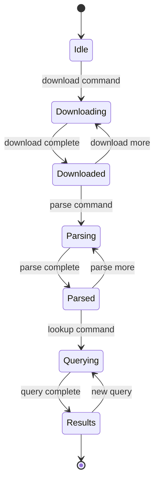

# State Flow - CourtFinder CLI

## Business State Diagram

## State Definitions
- **Idle**: CLI ready to accept commands
- **Downloading**: Fetching bulk data samples from freelaw.org
- **Downloaded**: Data files available locally for processing
- **Parsing**: Extracting structured records from bulk data
- **Parsed**: Records available in searchable format
- **Querying**: Processing search/lookup requests
- **Results**: Query results ready for display

## Transitions
- **download command**: User requests data download with size limits
- **download complete**: Sample data successfully downloaded and validated
- **parse command**: User initiates parsing of downloaded data
- **parse complete**: All records extracted and columns 12-18 handled
- **lookup command**: User performs search query
- **query complete**: Search results formatted for display